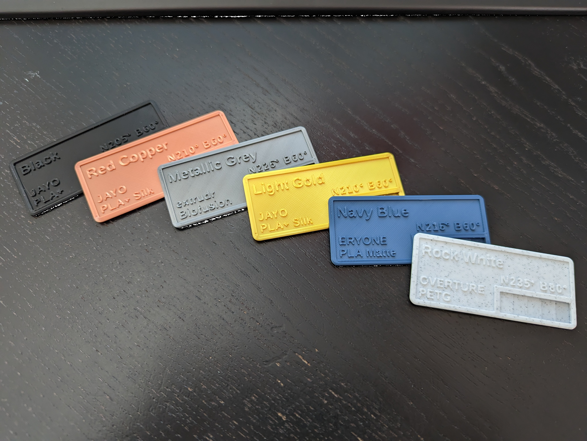
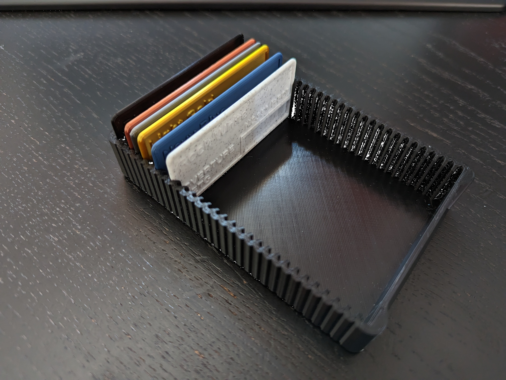
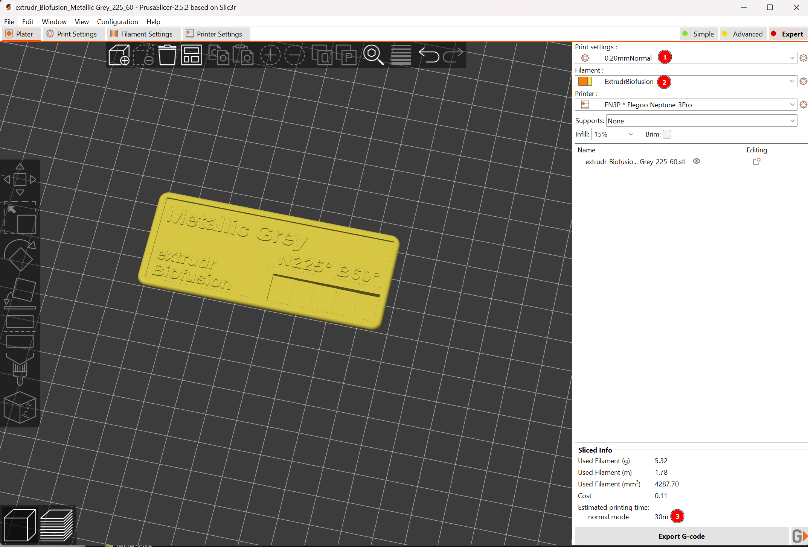
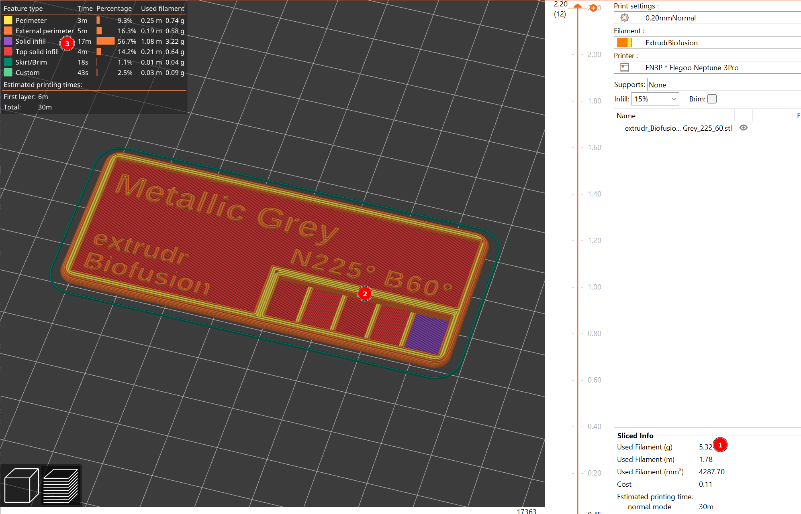

# Markus 3D Print Filament Sample Generator

[](https://ko-fi.com/R6R8DQO8C)

 Samples               | Samples Box (by Zahg)
:---------------------:|:-------------------------:
  | 

We've all come across like 100 different 3D print filament samples, but most require you to either request new ones from the author, or you need the special commercial CAD tool to go into the parameters and change the text yourself.

This generator is based on OpenSCAD, a completely free 'programmable' CAD tool.
But OpenSCAD is scary to 95% of all users because it essentially forces you to program your CAD model. Usually this is also not what I do, but for such samples this is the ideal approach.

So how is this any good? Easy: The packaged `gen_samples.py` script just reads a `samples.csv` file, where you can put in your list of samples you would like. No programming skills required.

## How To

- make sure you have OpenSCAD and Python available on your machine (see below for OS-specific prerequisite install instructions)
- make sure you have the 'Liberation Sans' Font available, it comes with LibreOffice or you can get it from here: <https://www.1001freefonts.com/de/liberation-sans.font>
- edit `samples.csv` and put in the filaments you like to generate samples for
- if you are not on Windows or your OpenSCAD install is not in the `C:\Program Files` standard path, edit `gen_samples.py` and at the top put in the path to the executable for the variable `OPENSCAD`, or just uncomment the `openscad` entry if it is accessible anywhere on your machine because it is part of your PATH variable 
- run `gen_samples.py`, if your Python install is in your PATH or `.py` files are linked you should even be able to just double-click it, if not get a command line shell and run `python gen_samples.py` (on Linux you might have to use python3 instead)

## Using VS Code

Another great method across systems is using VS Code. If you cloned this repo
and open it within VS-Code make sure you have the Python extension installed.
Then you can just edit the .csv right there, open the `gen_saples.py` script and immidiately run it with the play button in the upper right. Of course you still need some version of Python and OpenSCAD installed, Python should be found by VS Code if it is there.

## Using the stl-Models

The output will be generated under the `stl`-Folder.
If you pull the models into your Slicer make sure to select 0.2mm line thickness(1), the actual Filament profile(2) you want to print with.
The print time (3) will vary according to your print speed settings for that filament, but should be in the ballpark of 20-30min.



There should be approx 5g of filament being used (1) (depending on density of course)
Also make sure after slicing that the 'thickness staircase'(2) is visible (especially the single layer all the way to the right), there is no non-solid infill areas (3) and the letters look proper:



You can then proceed with printing! Have fun!

## Prerequisite Installation

### Windows

The by far easiest method nowadays is to use `winget`, just get a Powershell or a cmd-prompt and run:

```sh
winget install OpenSCAD.OpenSCAD
winget install Python.Python.3.11
```

This should work on all recently supported versions of Windows 10 and 11.

Alternatively go to the OpenSCAD and Python webpages and download the latest version from there.

### Linux

Any reasonably recent distribution will have a Python3 version available in the PATH as `python3`, for very recent ones `python` is also at version 3 already. You can check with `python --version`.

For OpenSCAD I recommend checking if your standard package manager has it available (like `apt`, `dnf`, `pacman` etc.). Usually the distros software centers also now search Flatpak or AppImage repositories, so I recommend you just search for OpenSCAD there and fetch it this way.

### MacOS

If you are running homebrew you should be able to get both Python 3 and OpenSCAD via `brew`, otherwise go to the webpages of OpenSCAD and Python and get the newest Mac distribution from there.

The standard path to the OpenSCAD binary on MacOS is `/Applications/OpenSCAD.app/Contents/MacOS/OpenSCAD`.

## Ackknowledgements
I derived this OpenSCAD model from blazerat over at printables: <https://www.printables.com/de/model/356074-filament-sample-card/files>

I really loved the temperature idea, but I like the form factor and Box better offered by Seemomster <https://www.printables.com/de/model/228249-filament-samples-42-materials> and originally Zahg (<https://www.printables.com/de/model/16322-filament-sample-with-box/files>)

So I basically turned the samples by blazerat into the form factor of Zahgs samples and box, with added info, while maintaining the 5-step thickness staircase.

## Your Support

If you like what you see, you can leave me a tip here:


